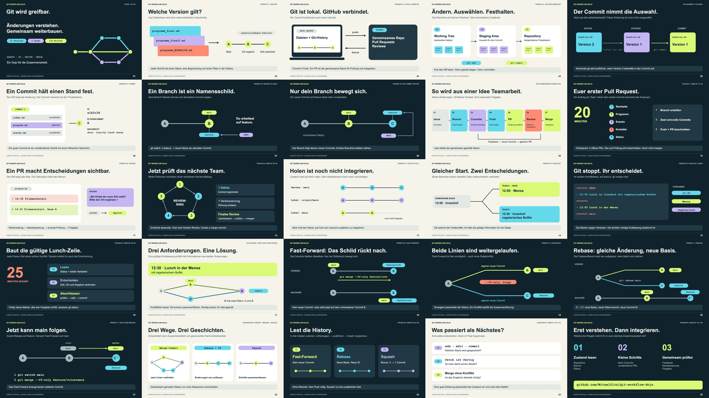

# Git wird greifbar – die visuelle Präsentation

25 Folien im Format 16:9, auf den [120-Minuten-Ablauf](../docs/workshop-flow.md) abgestimmt. Die Präsentation wechselt zwischen kurzen visuellen Erklärungen, Praxisfolien und Lernfragen. Sie ist als Begleitung der Übungen gedacht, nicht als zweistündiger Frontalvortrag.



## Präsentieren und bearbeiten

- [PowerPoint herunterladen](git-dojo.pptx): Texte, Formen und Diagramme sind native, bearbeitbare Objekte. Jede Folie enthält Sprechernotizen.
- [PDF öffnen](git-dojo.pdf): 25 Seiten mit skalierbaren Diagrammen und auswählbarem Text.
- [Browser-Präsentation](git-dojo.html): Datei herunterladen und lokal in einem Browser öffnen. Läuft ohne Internet oder Server.
- [Sprechernotizen lesen](speaker-notes.md): Erklärungen, Fragen, erwartete Antworten und Hinweise zur Moderation.
- [Canva-Importdatei](canva-import.html): feste Seiten mit einzeln importierbaren Texten, Formen und hinterlegten Sprechernotizen.

GitHub zeigt HTML-Dateien als Quelltext an. Für die Browser-Präsentation `git-dojo.html` herunterladen oder im lokalen Repository öffnen.

## Browser-Steuerung

| Taste / Element | Funktion |
| --- | --- |
| `→`, Leertaste, Page Down | Nächste Folie |
| `←`, Page Up | Vorherige Folie |
| Home / End | Erste / letzte Folie |
| `F` | Vollbild umschalten |
| `N` | Sprechernotizen ein- oder ausblenden |
| Menü unten | Direkt zu einer Folie springen; bei kleineren Fenstern ausgeblendet |
| Timer unten | Zeit der aktuellen Workshop-Runde starten, pausieren oder zurücksetzen |

Die Steuerleiste wird beim Darüberfahren oder Fokussieren deutlicher. Die Folie bleibt vollständig oberhalb der Leiste sichtbar. Der Timer läuft beim Weiterblättern innerhalb derselben Runde weiter. Beim Wechsel in eine andere Runde wird deren Zeit neu eingestellt; Start erfolgt bewusst per Klick.

Die Browser-Notizen erscheinen **auf demselben Bildschirm** wie die Folie. Für private Notizen während der Projektion die Referentenansicht von PowerPoint oder Canva oder ein zweites Gerät mit den Markdown-Notizen verwenden.

## Folien im Workshop einsetzen

| Zeit | Folien | Inhalt |
| --- | --- | --- |
| 00–15 | 1–9 | Git/GitHub, Working Tree, Staging, Commit, Branch, HEAD, Workflow |
| 15–35 | 10 | Erster Team-PR; nach dem ersten Commit Keyboard wechseln |
| 35–55 | 11–12 | Review-Beispiel, Review-Ring, Nachbesserung und Merge |
| 55–80 | 13–17 | Fetch/Pull, Konflikt lesen, selbst lösen, Lösung besprechen |
| 80–100 | 18–23 | Fast-Forward, Divergenz, Rebase, Vergleich und lokale Praxis |
| 100–120 | 24–25 | Lerncheck, Teamregeln und fünf Minuten Puffer |

Die Zeit einer Runde umfasst ihre Erklärungen **und** Praxis. Die Praxisfolien starten keine zusätzliche volle Runde. Folie 17 erst nach dem eigenen Konfliktversuch zeigen. Die Lösungen zu den Lernfragen auf Folie 24 stehen in den Sprechernotizen. Squash bleibt eine Zusatzaufgabe bei zusätzlicher Zeit.

## Visuelle Konventionen

Kreise stellen Commits dar; beschriftete Schilder stehen für Branches. Verbindungslinien zeigen die Abstammung, ältere Stände liegen links. Pfeile erklären Aktionen oder Referenzen. Die Folien 7 und 8 sowie 18 bis 21 zeigen Veränderungen in aufeinanderfolgenden Zuständen. Es sind keine PowerPoint-Objektanimationen erforderlich.

Jede Grafik ist aus Formen, Linien und Text aufgebaut. Farbflächen helfen beim Wiedererkennen; Begriffe und Commit-Buchstaben machen die Darstellung zusätzlich lesbar. Die Beispiel-IDs sind illustrativ. Git-Objekte werden nicht als physische Vollkopien jedes Dateistands erklärt.

## Neu erzeugen

Nur zur Pflege der Präsentation; für das Präsentieren ist keine Installation nötig:

```bash
python3 -m venv .venv-slides
.venv-slides/bin/pip install -r presentation/requirements.txt
.venv-slides/bin/python presentation/build_deck.py
.venv-slides/bin/python -m playwright install chromium
.venv-slides/bin/python presentation/render_deck.py
```

Diese Befehle sind für macOS/Linux. Unter Windows die entsprechenden Programme in `.venv-slides/Scripts/` verwenden. Alternativ kann `render_deck.py --chrome PFAD` ein vorhandenes Chrome/Chromium nutzen.

`build_deck.py` erzeugt PowerPoint, Browser-Version, statische Druckvorlage `print.html`, Canva-Importdatei und Sprechernotizen aus demselben Inhalt. `render_deck.py` erzeugt PDF und Übersicht und prüft Textbegrenzungen, Navigation, Notizen, Timer sowie die Trennung von Folie und Steuerleiste. Canva-Änderungen werden nicht automatisch zurück in den Generator übernommen.

Geprüft wurden alle 25 gerenderten Folien, PDF-Seiten und PowerPoint-Notizen sowie die Browser-Steuerung bei 1600 × 900 und 960 × 540. Die PowerPoint-Datei wurde auf native Formen und Texte geprüft; eine separate Darstellung in der PowerPoint-Anwendung war nicht Teil dieser Prüfung. Die importierte Canva-Fassung wurde über alle 25 Seitenvorschauen und die übernommenen Notizen kontrolliert.

## Fachliche Vertiefung

Das [Glossar](../docs/glossary.md) erklärt die Begriffe und verlinkt die Referenzen. Für die hier dargestellten Kernprinzipien: [Git Add](https://git-scm.com/docs/git-add), [Branching und Merging](https://git-scm.com/book/en/v2/Git-Branching-Basic-Branching-and-Merging), [Rebase](https://git-scm.com/book/en/v2/Git-Branching-Rebasing), [Remote-Branches](https://git-scm.com/book/en/v2/Git-Branching-Remote-Branches) und [GitHub PR-Merge-Methoden](https://docs.github.com/en/pull-requests/reference/pull-request-merges).
